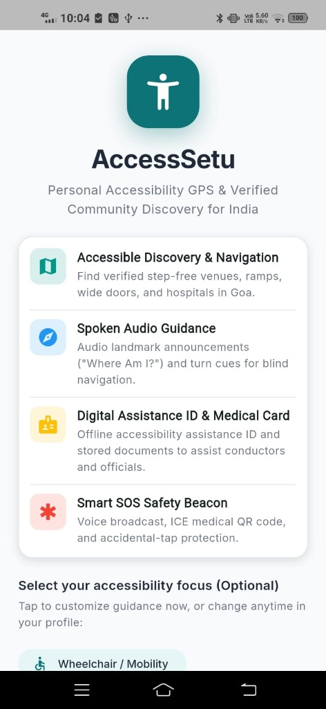
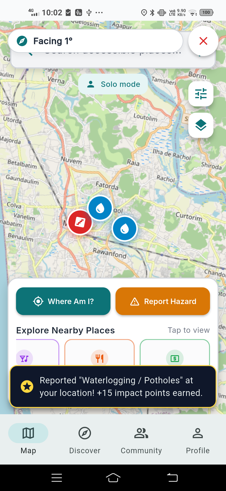

# AccessSetu (एक्सेस सेतु)

> **Accessible Navigation, Spoken Turn Guidance, and Digital Disability Credentials — Built for India.**

---

## The Story Behind AccessSetu

Every day, millions of people with disabilities, elderly citizens, and parents with strollers face journeys that look trivial on conventional map apps. A route says *"500 meters — 6 min walk"*. 

**What conventional maps don't tell you:**
- Is the footpath broken or blocked by construction?
- Does the clinic entrance have five stairs and no ramp?
- For someone with low vision, which way are you actually facing when you exit a bus?
- When boarding public transit or entering a government office, how do you quickly prove your disability credentials without digging out fragile paper certificates?

For a wheelchair user or a person with visual impairment in cities like Panaji or Margao, a journey doesn't fail because the destination is missing. It fails because of the **invisible barriers** along the way.

We built **AccessSetu** to bridge that gap. It is a lightweight, privacy-focused mobile application that turns OpenStreetMap into a living accessibility companion — guiding users with relative turn degrees, spoken landmarks, crowdsourced hazard warnings, and a digital offline Unique Disability ID (UDID) pass.

---

| Welcome & Persona Setup | Accessible Map & Hazard Reporting |
| :---: | :---: |
|  |  |

---

## What Makes AccessSetu Different

### 1. Spoken Guidance & Compass Heading (Hands-Free)
- **15-Second Stationary Prompts**: When stopped or hesitating, announces precise relative turn angle and distance (e.g., *"Turn 19 degrees right, then walk 45 meters"*).
- **Live Azimuth Compass**: Dial shows relative turn angle (`R19°`, `L25°`, `0°`) directly toward the next maneuver.
- **"Where Am I?"**: 1-tap voice readout of current street location and nearest landmark.

### 2. Offline Digital Disability Pass (UDID)
- Stores official UDID certificate data with an offline scannable QR code for transit staff and conductors.
- Built-in on-device OCR scanner reads physical UDID cards directly from camera.

### 3. Community Hazard Alerts
- 1-tap crowdsourced reporting for waterlogging, potholes, or blocked ramps with instant **+15 community impact points**.

### 4. Emergency SOS Beacon
- 3-second accidental-tap protection, repeating high-volume audible siren, spoken distress loop, and 1-tap ICE emergency dialer.

---

## Tech Stack

- **Mobile Framework**: Flutter 3.x / Dart 3.x
- **Maps & Routing**: OpenStreetMap, `flutter_map`, OSRM API (Zero API cost)
- **Audio & Sensors**: `flutter_tts`, `flutter_compass`, `geolocator`, `vibration`
- **Vision & Scanning**: `google_mlkit_text_recognition`, `qr_flutter`
- **Cloud & Scalability (Roadmap)**: Google Firebase (Auth, Cloud Firestore, Firebase Cloud Messaging)

---

## Project Architecture

```text
lib/
├── app/
│   ├── access_map_app.dart         # Root application & routing
│   └── app_state.dart              # Global state coordinator
├── core/
│   ├── services/
│   │   ├── osrm_routing_service.dart   # Real street & footpath routing
│   │   ├── exploration_service.dart    # 15-sec stationary voice prompts & compass
│   │   ├── tts_service.dart            # Spoken audio engine
│   │   ├── ocr_service.dart            # On-device UDID certificate scanning
│   │   └── offline_map_service.dart    # Regional map tile downloads
│   └── theme/                          # High-contrast accessible color palette
├── features/
│   ├── map/                            # MapScreen, compass HUD, mode toggles
│   ├── onboarding/                     # First-time persona selection
│   ├── profile/                        # UDID Pass, ICE medical ID, travel modes
│   ├── contributions/                  # Community audits, leaderboard & points
│   └── emergency/                      # SOS siren beacon & emergency dialer
└── shared/
    └── models/                         # Place, Hazard, Profile, and Route models
```

---

## Future Scope and Roadmap

### 1. Firebase Cloud Sync and National Multi-City Rollout
Migrate local cache stores to Firebase Cloud Firestore for real-time synchronisation across thousands of concurrent users, enabling community audits to scale from Goa to Mumbai, Bangalore, Delhi, and nationwide.

### 2. Government UDID Portal Integration (Swavlamban API)
Integrate directly with the Ministry of Social Justice and Empowerment's Swavlamban Card API for automated, tamper-proof verification of disability certificates and seamless government welfare entitlement access.

### 3. Edge AI and Computer Vision Obstacle Detection
Deploy lightweight, on-device vision models (such as YOLO or Edge AI) allowing users to point their smartphone camera forward while walking to detect sidewalk hazards, potholes, open drains, and stairs in real time with audio warnings.

### 4. Public Transit Fleet Integration (GTFS)
Partner with public transport fleets (such as Goa's Kadamba KTCL) to ingest live GTFS feeds, highlighting wheelchair-accessible low-floor buses, boarding ramps, and automated stop announcements.

### 5. Multilingual Voice Guidance
Expand spoken navigation beyond English to regional Indian languages including Konkani, Hindi, Marathi, and Kannada.

### 6. "Saathi" Volunteer Companion Dispatch
Build an on-demand volunteer dispatch module connecting individuals who need physical guidance with vetted local volunteers and NGO partners for last-mile assistance.

### 7. Indoor Navigation & BLE Beacon Mesh
Deploy Bluetooth Low Energy (BLE) beacons and Ultra-Wideband (UWB) indoor positioning to enable turn-by-turn navigation inside GPS-denied environments like hospitals (GMC Bambolim), railway stations, and transit terminals.

### 8. Wearable & Haptic Direction Feedback
Develop a companion smartwatch app (Wear OS / watchOS) delivering directional haptic pulses to the user's wrist (e.g., directional taps for turns, continuous pulses for approaching obstacles) for discreet, eyes-free navigation in crowded public spaces.

### 9. Municipal Public Works & Civic Dashboard
Provide local municipal bodies (such as the Corporation of the City of Panaji and Public Works Department) with an administrative dashboard that automatically converts geotagged citizen hazard reports into prioritized maintenance tickets.

### 10. Passive Surface Roughness & Incline Sensing
Use device accelerometer and gyroscope telemetry while in motion to automatically classify sidewalk surface quality (paved, gravel, cracked) and incline steepness, generating crowdsourced accessibility heatmaps passively without manual data entry.

---

## Getting Started

### Prerequisites
- Flutter SDK (3.24+ recommended)
- Android SDK (API 29+) or an Android device connected via USB

### Run Locally
```bash
# 1. Clone repository
git clone https://github.com/virtuallysarvad/access_app.git
cd access_app

# 2. Install dependencies
flutter pub get

# 3. Launch on connected device
flutter run
```

### Automated GitHub Release (CI/CD)
To compile and publish a production APK automatically via GitHub Actions:
```bash
git tag v1.0.0
git push origin main --tags
```
The workflow will compile and publish the single release APK (`AccessSetu-test.apk`) directly on the GitHub Releases page.

---

## Team
Built for accessible mobility at **Bit & Build 2026**.
